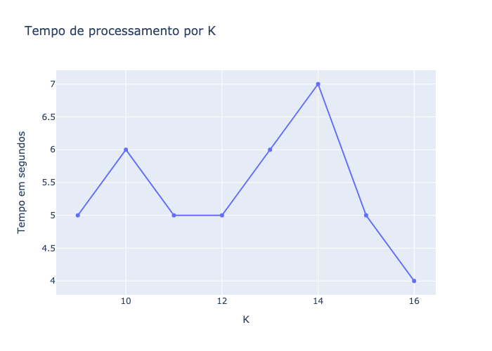

# lzw-algorithm

> Primeiro projeto da disciplina de Introdução à Teoria da Informação,
> cujo o objetivo é implementar um compressor e descompressor utilizando o algoritmo LZW.

## Equipe

[Lucas Moreira](https://github.com/lucasmsa),
[Marismar Costa](https://github.com/marismarcosta),
[Gustavo Eraldo](https://github.com/EraldoCi)

## Introdução

Inventado por Abraham **L**empel, Jakob **Z**iv e Terry **W**elch, o LZW é um algoritmo de compressão baseado
em dicionário (também conhecido como _factor substitution_), que consiste em
substituir uma sequência de caracteres (ou _factor_) por um código mais curto que
o índice correspondente no dicionário.

Em geral, a objetivo do LZW é obter uma redução da entropia, não apenas em um único caracter, mas em todas as palavras.

A seguir é apresentado o [pseudocódigo do algoritmo de compressão e descompressão LZW](https://www.amazon.com/Foundations-Coding-Compression-Encryption-Correction/dp/1118881443).

### Algoritmo de compressão

```py
word="";
while not end of file;
    x=read next character;
    if word+x is in the dictionary
        word=word+x;
    else
        send the dictionary number for word
        add word +x to the dictionary
        word=x
end of while loop
```

### Algoritmo de descompressão

```py
read a character x from compressed file;
write x to uncompressed version;
word=x;

while not end of compressed file do begin
    read x
    look up dictionary element corresponding to x;
    output element
    add w + first char of element to the dictionary
    w  = dictionary element
endwhile
```

## Metodologia

Para realizar tanto a compressão quanto descompressão dos dados é necessário
se atentar ao modo de leitura dos arquivos, além da incialização e tamanho do dicionário.

Tendo isso em vista, para o primeiro caso foi estabelecido que todos arquivos
devem ser lidos no modo binário, assim, facilitando a leitura de qualquer tipo de
informação, seja texto, imagem ou vídeo.

Logo, o dicionário é inicializado, em ambos os modos de operação, com
os 256 símbolos da tabela [ASCII](https://www.rapidtables.com/code/text/ascii-table.html).

Dessa forma, o tamanho mínimo do dicionário será 2^9 = 512 bits. O _K_ é considerado um
parâmetro de entrada, com o intuito de observado o comportamento da **razão de compressão**
ao variar o tamanho do dicionário e dada uma mesma entrada. Além disso, o _K_ deve estar no intervalo **[9, 16]**.

Para realizar a análise comportamental do LZW, foram disponibilizados dois
arquivos em formato de texto e vídeo: [corpus16MB.txt](/data/test/) e
[disco.mp4](/data/test/) repectivamente.

Em relação ao algoritmo de compressão, foi realizada uma alteração na pesquisa
de palavras existentes, de modo que se pesquisa a maior
sequência de caracteres presente no dicionário. Assim, o algoritmo de compressão tem
o seguinte funcionamento:

```py
indice = 0;

Enquanto != fim da mensagem, faça:
    simb_atual = mensagem[indice]
    prox_simb = mesagem[indice+1]

    Enquanto (simb_atual + prox_simb) estiver no dicionário:
        simb_atual = (simb_atual + prox_simb)

        Se (simb_atual + prox_simb) não estiver no dicionário:
            adiciona (simb_atual + prox_simb) no dicionário
            mensagem_codificada.append(simb_atual + prox_simb)
        ...
```

O algoritmo foi implementado em **python** e utilizou as seguintes bibliotecas: **os**, **sys**, **struct**, **pathlib**, **tqdm** e **typing**.

Para a análise de resultados, foi considerado a métrica de desempenho **razão de compressão** (RC), descrita pela seguinte expressão:

**RC = tamanho_original / tamanho_compactado**

Contudo, para estimativa do tamanho do arquivo compactado, baseado na quantidade de índices do dicionário, foi aplicado o cálculo abaixo:

**tamanho_compactado = (quantidade_indices \* k) / 8**

Além disso, a análise dos resutados também considerou o tempo de processamento do algoritmo e a quantidade de índices utilizada em função da variação de **k**.

## Análise de resultados

O algoritmo foi aplicado e analisado nos dois arquivos, [corpus16MB.txt](/data/test/) e
[disco.mp4](/data/test/), considerando a variação de k entre 9 e 16 bits.

### Arquivo de texto

Para aplicação do LZW no arquivo _.txt_, houveram algumas dificuldades durante a implementação da compressão, inclusive relacionadas a acentuação de caracteres, porém a utilização de bibliotecas, em especial **struct**, permitiu atingir o comportamento adequado.

No Gráfico abaixo, é apresentado a curva da **razão de compressão** em função da variação do _k_ resultante da aplicação do LZW no arquivo corpus16MB.txt.

<figure>
  
  <figcaption>Gráfico 1 - Razão de compressão por K</figcaption>
</figure>

Então, percebe-se um significativo aumento da **razão de compressão**
a medida que é incrementado _k_.

O Gráfico 2 é referente a relação entre quantidade **total de índices** utilizados no processo de codificação e a variação de _k_.

<figure>
    
    <figcaption>Gráfico 2 - Índices por K</figcaption>
</figure>

Dessa forma, verifica-se que a quantidade de índices necessários para
codificar a mensagem diminui com o incremento de _k_. Este comportamento é coerente com o esperado, pois quanto maior o dicionário, mais
sequências são salvas e, consequentemente, uma menor quantidade de índices é necessária.

A seguir, o Gráfico 3 apresenta o **tempo de processamento** do algoritmo LZW considerando valores de _k_ entre 9 e 16.

<figure>
    
    <figcaption>Gráfico 3 - Tempo de processamento por K</figcaption>
</figure>

Então, para o arquivo _.txt_, os melhores tempos de processamento foram obtidos para k = 11 e k = 12. Para os demais valores de _k_, o tempo de processamento ficou entre **33 e 38 segundos**, exceto pelo caso _k_ = 10 que resultou em aproxidamente 50 segundos de processamento.

### Arquivo de vídeo

O debug e testes iniciais do algoritmo foram baseados em arquivos de texto. Somente após a observação de um comportamento aceitável, foram realizadas as primeiras execuções no arquivo de vídeo. Dessa forma, não houveram grandes dificuldades de implementação para esse tipo de arquivo em específico.

No Gráfico 4, tem-se a curva de **razão de compressão** em função de _k_ para o arquivo _.mp4_.

<figure>
  
  <figcaption>Gráfico 4 - Razão de compressão por K</figcaption>
</figure>

Diferente do comportamento esperado, a razão de compressão diminui gradativamente para valores de _k_ < 14 e aumenta para valores de _k_ >= 14. Isso pode ter interferência do formato do arquivo, uma vez que **mp4** já é um formato compactado.

A seguir, o Gráfico 5 apresenta a relação entre a quantidade total de índices para codificação e _k_.

<figure>
    
    <figcaption>Gráfico 5 - Índices por K</figcaption>
</figure>

Assim como a curva obtida para o arquivo de texto, o número total de índices decresce conforme _K_ aumenta de valor. No geral, foram utilizados entre 1.2M e 2.2M índices para _k_ entre 9 e 16 bits.

Por último, tem-se o Gráfico referente ao tempo de processamento do algoritmo em função de _k_ para o arquivo _.mp4_.

<figure>
  
    <figcaption>Gráfico 6 - Tempo de processamento por K</figcaption>
</figure>

É possível observar que o tempo de processamento ficou entre **4 e 7 segundos**, porém com uma moda equivalente a **4 segundos**. No geral, o tempo de processamento do arquivo _.txt_ **(16MB)** foi até 9 vezes mais lento que o arquivo _.mp4_ **(2.1MB)**.

Após a aplicação da compressão no vídeo, o arquivo compactado permanece executável.

## Considerações finais

O trabalho desenvolvido permitiu uma expansão dos conhecimentos abordados em sala de aula, além da visão prática da teoria discutida por autores da literatura.

Embora, os resultados não sejam tão bons quanto algumas tecnologias mais atuais afirmam disponibilizar, a abordagem utilizada no trabalho é a base de várias dessas soluções, como o **TIFF** e **GIF**.
